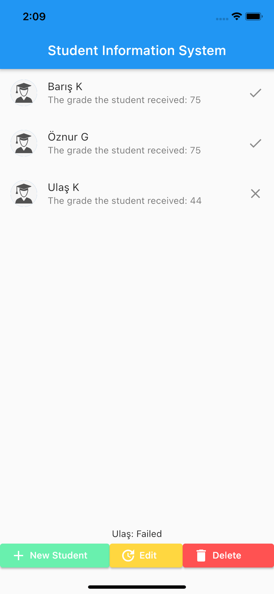
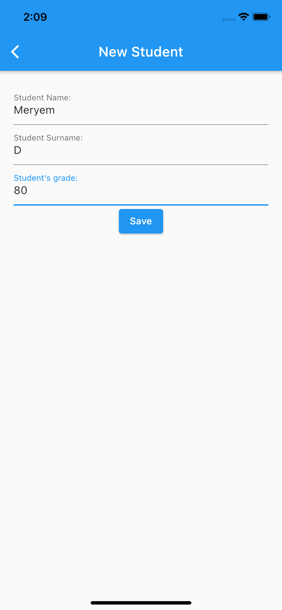
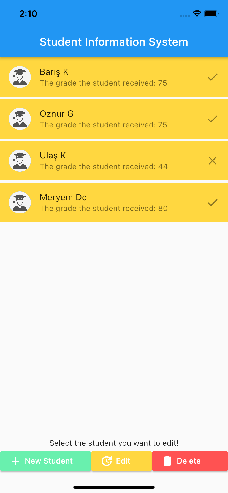
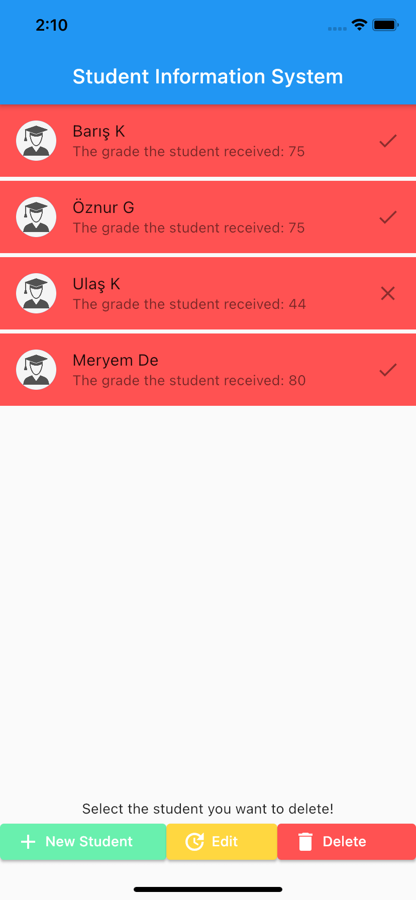

# Student Information System

An app for track student's grades.

## Through this project, I've learnt:

- variables in Dart Language.
- basic Flutter Widget Architecture.
- conditional blocks in Dart Language.
- lists in Dart Language.
- functions in Dart Language.
- usage of functions on the Flutter side.
- OOP in Dart Language and how to apply it to Flutter.
- state management in Flutter.
- navigation architecture.
- Mixins in Dart Language.
- the Working Logic of Reference Types on the Project

Screenshots of the app:

&nbsp; &nbsp; &nbsp; &nbsp; &nbsp;

&nbsp; &nbsp; &nbsp; &nbsp; &nbsp;
